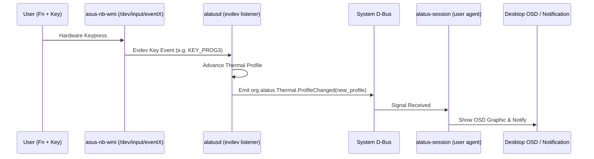

# ASUS Vivobook S 15 Hotkeys & Input Event Specification

## 1. Overview
ASUS laptops route OEM special function keys and hotkeys (Fan profile switch, Mic mute, Screen brightness, Touchpad toggle, ROG/Aura key) through the ACPI WMI bus to the kernel driver `asus-nb-wmi`.

The driver exposes these events to userspace via an `evdev` input device.

## 2. Input Device Identification
Querying `/proc/bus/input/devices`:
- **Device Name**: `"Asus WMI hotkeys"`
- **Physical Path**: `asus-nb-wmi/input0`
- **Bus**: `0x0019` (`BUS_HOST`)
- **Event Node**: `/dev/input/event*` (typically `event3` or discovered via `/dev/input/by-path/platform-asus-nb-wmi-event`)

## 3. Keycode Mappings

| Physical Key / Function | Linux Linux Keycode (`linux/input-event-codes.h`) | Numeric Code | Alatus Action |
| :--- | :--- | :--- | :--- |
| **Fan Profile Switch (Fn + F)** | `KEY_PROG3` / `KEY_F17` | `202` / `187` | Cycles thermal profile: `Quiet` -> `Balanced` -> `Performance` -> `FullSpeed` (if available) -> `Quiet`. |
| **Microphone Mute (F9 / Fn + F9)** | `KEY_MICMUTE` | `248` | Handled natively by pipewire/pulse, signaled via Alatus OSD if requested. |
| **Touchpad Toggle (Fn + F10)** | `KEY_F21` / `KEY_TOUCHPAD_TOGGLE` | `191` / `530` | Handled by compositor or Alatus input toggle. |
| **Aura / Keyboard Light (Fn + F4)**| `KEY_KBDILLUMTOGGLE` / `KEY_KBDILLUMUP` | `228` / `229` | Cycles keyboard backlight brightness or animations. |
| **Sleep / Power** | `KEY_SLEEP` | `142` | Handled by systemd-logind. |

## 4. Event Processing Architecture

## 5. Hardware Reference & Licensing Notes
- **Reference**: Linux kernel `drivers/platform/x86/asus-wmi.c`.
- **Reference**: `asusctl` hotkey monitor (`daemon/src/ctrl_hotkeys.rs`).
  - Source: [OpenGamingCollective/asusctl](https://github.com/OpenGamingCollective/asusctl).
